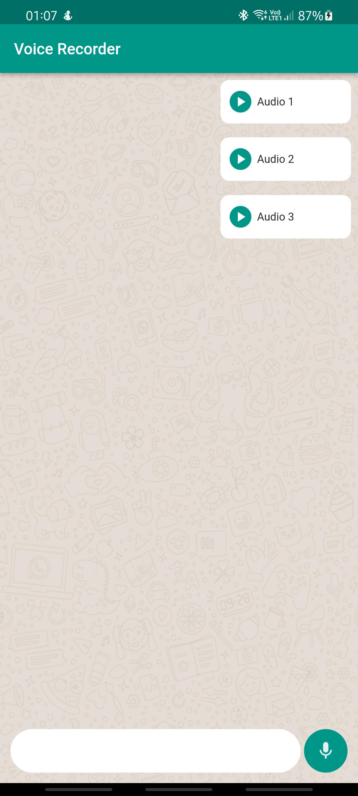
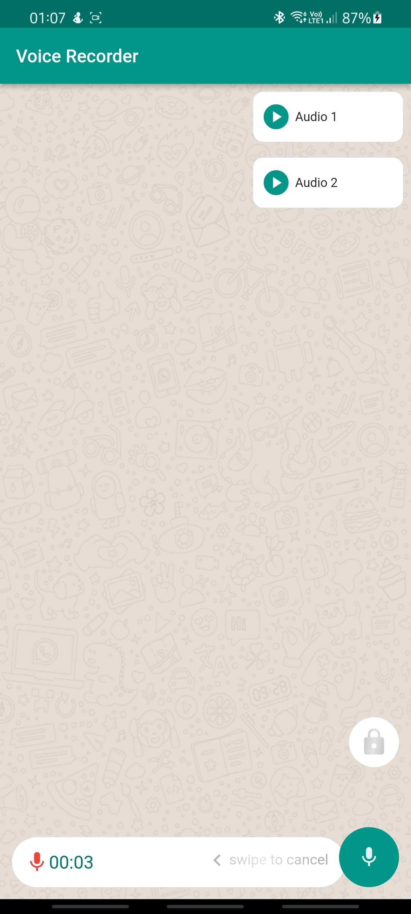
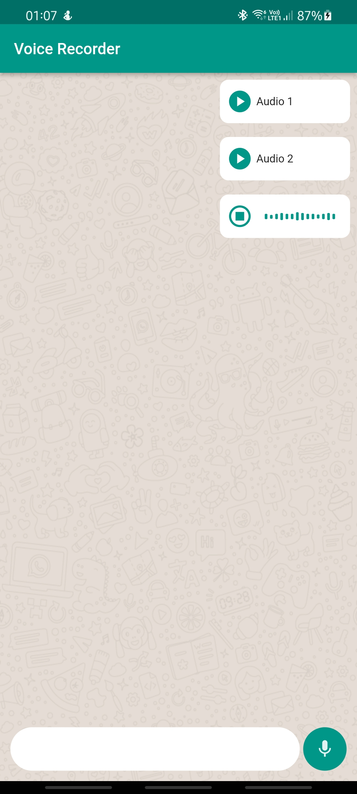

# Flutter Whatsapp Voice Recorder

A flutter project to demonstrate the Voice Recording and Playback feature of WhatsApp with Custom Animations.

The app has been built to showcase the MVVM + Clean architecture model. 
<ul>
<li>The view is only reponsible for user interaction and nothing else.</li>
<li>The ViewModel handles all the business logic for the View.</li>
<li>The Service provide all the functionality required by the ViewModel. This helps in decoupling the dependency and packages can be swapped easily when needed.</li>
<li>The Repository provide the Service, the methods to achieve the functionality or complete the request.</li>
<li>The DataStoreFactory hides all the logic for the source of the data, ie: whether it is coming from the local DB or remote api service.</li>
<li>A service locator is used for Dependency Injection to create all the necessary classes.</li>
</ul>

  
The following functionalties are supported by the recorder:
<ul>
<li>The recording starts on long press of the button.</li>
<li>The audio gets saved when the long press is released.</li>
<li>The audio record can be cancelled by swiping left.</li>
<li>The longer audio record can be enabled by swiping the button vertically to lock.</li>
<li>The audio list gets populated immediately when the recording is stopped.</li>
<li>The audio can be played by tapping on the card and a waveform indicator is shown to indicate the playing file.</li>
</ul>

  
The demo also shows proper package mangement which is very essential for scaling and keeping the code neat and tidy. 
Wherever needed, the code are converted to methods, and they are used across multiple files then separated to common files. 

  
If I had more time I would have done the following: 
<ul>
  <li>Animation for the mic and bin when recording is cancelled.</li>
  <li>Add a better handling for Exceptions.</li>
  <li>Include the progress indicator and timer when the audio is played.</li>
</ul>

  
APK of the app can be found under apk folder. Here are few screenshots and screen recording to showcase the app:
  

List UI:    

Recording UI:   

  

Playing UI:   

Demo Recording: 
